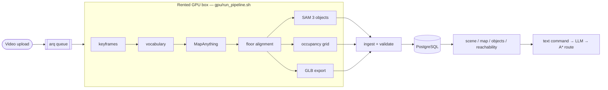

# CloudEye: from a phone walkthrough to a robot-ready map (Main Repo: [github.com/artigrib/cloudeye](https://github.com/artigrib/cloudeye))

**A walkthrough video of a room becomes one metric map a robot can plan on.**

Film a room with a phone. CloudEye reconstructs it in 3D, finds the objects in it, and
serves a single occupancy map that both the viewer and the path planner read — plus a text
command box that plans a route between objects.

📺 **90-second demo:**
<https://www.linkedin.com/feed/update/urn:li:activity:7504007563198464000/>


**What it is not.** Not real-time SLAM — this is offline, video in, scene out, minutes not
milliseconds. Not a mesher: surfaces are point clouds and convex hulls. It does not merge
several videos of one room into one scene. It does not drive a robot; it plans a path and
hands it to you. And its accuracy has real limits — read [Limits](#limits) before trusting
a number from it.

---

## Architecture



- **Backend** — FastAPI (async), SQLAlchemy 2.0 + PostgreSQL 16, arq + Redis, Alembic.
  Python 3.12, managed with `uv`.
- **GPU pipeline** (`gpu/`) — stdlib-only stage scripts, rsync'd to the rented instance
  before every job and driven over ssh. The backend never holds an ssh session open: it
  starts the run detached and polls a `status.json` with a fresh short-lived call. No
  webhook, no inbound port.
- **Frontend** (`frontend/`) — React 19, Vite, Three.js, Tailwind, TypeScript.
- **`pipeline/`** — a separate, resumable driver that adds nvblox and rents its own GPU box.
  See [docs/GPU_VAST.md](docs/GPU_VAST.md).

One video becomes one **scene**: a self-contained reconstruction with its own metric frame.
Scenes group into **workspaces**. Every scene passes a mandatory validation gate before
anything reaches the database — floor below every camera, ceiling above it, plausible room
size, and object-type height priors. That gate caught two real incidents where the geometry
looked internally consistent and was wrong (an inverted Y axis; RANSAC fitting the ceiling
as the floor). A failed scene ends up `failed` with zero object rows, never half-populated.

## One map for the planner

The thing this project is actually strict about.

Two grids are involved in answering "can the robot get there": the **inflated cost grid** a
route is planned on, and the **tri-state grid** `GET /api/scenes/{id}/map?robot_id=…` serves,
which is what a person looks at. **They must be the same grid.** If they drift apart the UI
draws a clean route through a table and nothing anywhere says so.

They did drift apart. The old density-histogram occupancy could not see a table top at 0.9 m,
and on one scene the planner drew **14 cells of route straight through furniture** — with a
confident line on screen and no warning (`app/services/nav_layer.py:9`). The fix was not a
better renderer; it was making one layer the single source for both, and then asserting it:

> **Obstacle cells on any planned route = 0.** Hard fail.
> Unknown cells on a route are allowed, counted, and printed.

That assertion is `tests/acceptance/probe_route_obstacles.py`, and it runs against every
registered robot platform, not the two a demo happens to show. Unknown stays traversable
because blocking it measures 0 of 17 objects reachable for every robot on a scene where 43%
of the grid was never directly observed (`pipeline/steps/layers/room_measure.py:58`).
Obstacles are the line that does not move.

The same rule is why reachability is answered per robot radius from that one layer, and why
the object list can say an object is unreachable and mean it.

## Quickstart

```bash
git clone https://github.com/artigrib/cloudeye.git && cd cloudeye
cp .env.example .env                              # every variable is documented in place
sudo -u postgres createuser robot --pwprompt && sudo -u postgres createdb robotdb -O robot
mkdir -p var/uploads var/frontend_layers
uv sync && uv run alembic upgrade head

./run_api.sh                                      # API   127.0.0.1:8000
uv run arq app.worker.WorkerSettings               # worker
cd frontend && npm ci && npm run dev               # UI    127.0.0.1:5173
```

Then open <http://127.0.0.1:5173/workspaces>. Full version, including what needs a key and
what does not: **[docs/INSTALL.md](docs/INSTALL.md)**. A tour of the screens:
**[docs/USER_GUIDE.md](docs/USER_GUIDE.md)**.

Docker files (`docker-compose.yml`, `Dockerfile.api`, `Dockerfile.web`) are in the
repository but are **written, not executed** — the native path above is the verified one.

## Deploy

Ubuntu 24.04, two systemd units, everything on loopback behind ssh, ufw allowing only port
22. Migrations are applied **before** any restart, never after. Full runbook, including the
update and rollback procedure: **[docs/DEPLOY.md](docs/DEPLOY.md)**.

## GPU

Processing video needs a rented GPU box. Two paths exist:

- the **7-stage `gpu/` path**, fully automated, driven by the arq worker over ssh;
- the **`pipeline/` driver**, resumable, adds nvblox, and rents its own box on vast.ai with
  an armed-file safety, a per-run cap and a daily cap.

Measured on real runs: provisioning a fresh 4090 from `pipeline/box/onstart_nvblox.sh` takes
**4 min 12 s** (4:12), and one room costs about **$0.13** (`docs/PIPELINE.md:95`, `:306`). A
one-minute walkthrough through the 7-stage path takes about 16 minutes end to end, of which
the SAM 3 `objects` stage is 75% (`docs/COMPARISON.md:194`).

**MapAnything pass A is manual in the `pipeline/` driver today** — it parks and tells you
where to put the output rather than pretending to run it. Details, the vast.ai offer
criteria, the budget cap, and `ARMED` vs `PIPELINE_WORKER_ENABLED`:
**[docs/GPU_VAST.md](docs/GPU_VAST.md)**. Every model, id, licence and measured cost:
**[docs/MODELS.md](docs/MODELS.md)**.

## Limits

Stated plainly. These are open problems, not solved-with-caveats.

- **Monocular drift — reconstruction is not repeatable to better than ~7%.** Four
  independent MapAnything runs against the same room's ceiling height spread from 2.76 m to
  2.97 m. Fine for navigation and coarse layout; not tight enough for picking an object off
  a shelf at a known height. Two videos of the same room diverge by ~10 cm on shared
  reference objects, which is why scenes are never merged.
- **Wall gaps and unobserved space.** A handheld walkthrough does not see everything. On the
  hero scene **43% of the occupancy grid was never directly observed**
  (`pipeline/steps/layers/room_measure.py:58`). Unknown cells are a real third state, not
  free space, and the grid is a point-density histogram with no ray-based free-space
  carving: a cell with zero points may be genuinely free or simply never seen. Walls
  therefore have holes where the camera never looked, and reachability answers carry an
  `unobserved_frac` for exactly this reason.
- **Empty rooms reconstruct unstably.** A furniture-free corridor gave floor/ceiling
  disambiguation a support ratio of 1.18x against a furnished room's 2.6x, and which plane
  was picked as "floor" flipped between runs on the same footage. The validator failed both
  bad runs rather than writing corrupted geometry — but the pipeline is not robust to this
  input yet.
- **Glossy floors produce phantom geometry below the floor plane.** Monocular depth reads a
  reflection as real geometry. A one-sided clip removes points clearly below the fitted
  floor; it does not fix depth estimation on reflective surfaces.
- **No semantics on 15 fps scenes yet.** Scenes produced by the `pipeline/` driver have no
  object vocabulary: its `SEMANTICS` stage is a declared slot that does nothing and says so
  (`pipeline/run_pipeline.py:1561-1567`). Those scenes get geometry, layers and
  reachability, but no named objects — object naming only happens on the 7-stage `gpu/` path.
- **No authentication. None.** No login, no token, no per-user anything. Every endpoint is
  open to anyone who can reach the port, including the ones that delete scenes. The API
  binds `127.0.0.1` on purpose and is meant to be reached through an ssh tunnel. Do not put
  it on a public interface without putting auth in front of it first.
- **Vocabulary calls are non-deterministic.** Three repeat calls at `temperature: 0` with
  byte-identical input returned three different object vocabularies. Object counts and
  reachability ratios are therefore not valid metrics for comparing two runs
  (`docs/COMPARISON.md:30-56`).
- **No mesh.** `GET /api/scenes/{id}/mesh` serves a points-primitive GLB. USD object
  colliders are convex hulls, floors and walls axis-aligned boxes.
- **Isaac Sim export is targeted, not validated.** `GET /api/scenes/{id}/usd` is written
  against Isaac Sim 6.0.1 and has never been opened in one — see
  [docs/ISAAC_VALIDATION.md](docs/ISAAC_VALIDATION.md).

## Measured

- **Metric scale, checked but not calibrated.** A pedestal sink measured from the
  reconstructed cloud came out at 0.8375 m rim height against a real-world 0.79–0.86 m,
  with no scale correction applied. Evidence the metric claim roughly holds for that
  capture, not a guarantee.
- **Same room, two orientations.** Ceiling height 2.92 m filmed horizontally against 2.97 m
  vertically — two fully independent reconstructions, about 2% apart.
- **A representative scene.** 23 objects, a 3.6 × 4.3 m footprint, ~1.5M points.
- The numbers the UI shows are pinned by `tests/acceptance/` — the reachability counts, the
  tightest-gap figure, the export checksum — so a re-layout that moves them fails.

## Tests

```bash
uv run pytest                      # pure unit: no DB, no GPU, no network
cd frontend && npm test
python3 pipeline/tests/run_tests.py    # needs out-of-repo fixtures; see docs/INSTALL.md
```

Three pytest cases are red on purpose, each with a written reason and what would have to
change to make it green — [docs/KNOWN_TEST_FAILURES.md](docs/KNOWN_TEST_FAILURES.md). They
are not a broken checkout.

## Licence

Apache-2.0 — [LICENSE](LICENSE), [NOTICE](NOTICE). No model weights are in this repository
or its history; they are downloaded by name under your own accounts. Bundled assets, the
eight robot models and their sources, and every model this project depends on:
**[THIRD_PARTY.md](THIRD_PARTY.md)**.
